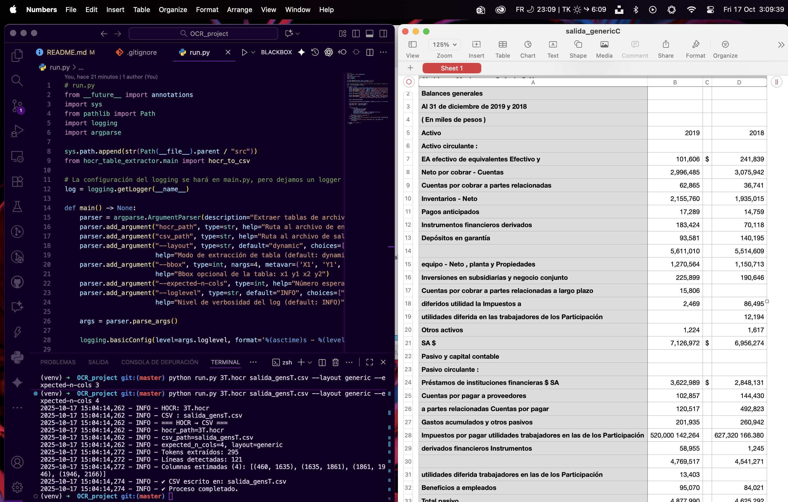

# HOCR Table Extractor

<p align="center">
  
</p>

Una herramienta modular para reconstruir datos tabulares a partir de archivos HOCR y exportarlos a formato CSV. El proyecto utiliza un enfoque personalizable para analizar la estructura de la tabla, permitiendo al usuario elegir entre diferentes estrategias de extracción.

## Estado del Proyecto y Guía para Evaluación

Este proyecto se ha desarrollado de forma iterativa, explorando diferentes algoritmos para la extracción de tablas. Como resultado, existen múltiples "layouts" o estrategias de extracción.

**Para fines de evaluación, se recomienda probar el layout `generic`**, ya que actualmente es el que produce los resultados más robustos y consistentes en una amplia variedad de documentos. Los otros layouts (`dynamic`, `financial`, `professional`) representan diferentes etapas de la evolución del proyecto y, aunque funcionales, pueden no ser tan estables.

Para una explicación técnica detallada de cada layout y la arquitectura general, por favor consulte el archivo `ARCHITECTURE.md`.

## Guía de Inicio Rápido

1.  **Instalar dependencias:**

    ```bash
    pip install -r requirements.txt
    ```

2.  **Ejecutar el extractor (Modo Recomendado):**

    Para obtener el mejor resultado, utilice el layout `generic`, de preferencia especificando el número de columnas que se esperan

    ```bash
    python run.py ruta/al/input.hocr ruta/al/output.csv --layout generic --expected-n-cols 4
    ```
> [!IMPORTANT]
> Los archivos `.hocr` deben estar en la raíz del proyecto

## Opciones Avanzadas y Layouts

### Layout `generic` (Recomendado)

Es el layout más fiable. Utiliza un doble análisis de perfiles de proyección (vertical para columnas y horizontal para filas) para reconstruir la tabla. Es la implementación de referencia.

-   **Uso:**
    ```bash
    python run.py input.hocr output.csv --layout generic
    ```
-   **Especificar número de columnas (opcional):**
    ```bash
    python run.py input.hocr output.csv --layout generic --expected-n-cols 4
    ```

### Layout `professional` (Experimental)

Este layout es un híbrido que intenta combinar la robusta construcción de tablas del `generic` con características avanzadas como la detección de jerarquía y la limpieza de datos. Aunque es funcional, su integración aún está en desarrollo y puede producir resultados inesperados.

-   **Uso:**
    ```bash
    python run.py input.hocr output.csv --layout professional
    ```

### Otros Parámetros

-   **Limitar a un área específica (Bounding Box):**

    ```bash
    python run.py input.hocr output.csv --bbox 80 220 1750 2450
    ```

-   **Ajustar el nivel de logs para depuración:**

    ```bash
    python run.py input.hocr output.csv --loglevel DEBUG
    ```

Para ver todas las opciones disponibles, ejecuta:

```bash
python run.py --help
```

## Dependencias

-   Python 3.9+
-   `beautifulsoup4`
-   `lxml`
-   `numpy`